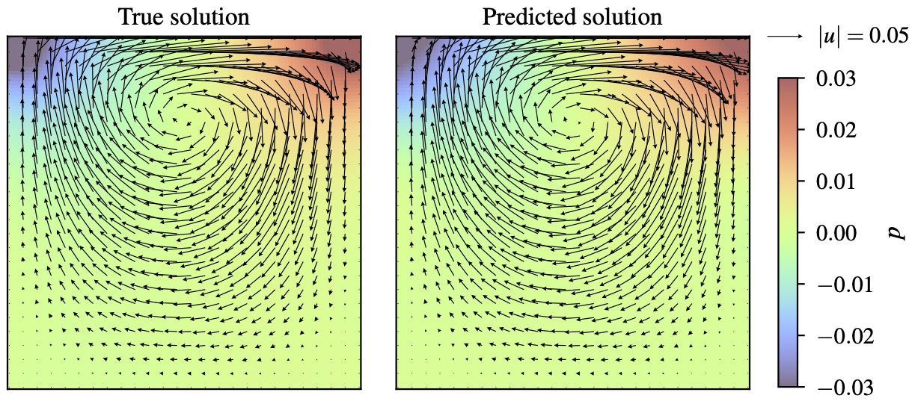

PI-DeepONets with Zero Coordinate Shift (ZCS)
=============================================

Zero Coordinate Shift (ZCS) is a low-level technique for maximizing
memory and time efficiency of physics-informed DeepONets (`Leng et al.,
2023 <https://arxiv.org/abs/2311.00860>`__). In this tutorial, we will
explain how to activate ZCS in an existing DeepXDE script. Usually, ZCS
can reduce GPU memory consumption and wall time for training by an order
of magnitude.

Prerequisite
------------

Your current script can be easily equipped with ZCS if you are using

-  TensorFlow 2.x, PyTorch or Paddle as the backend (**use PyTorch for
   best performance**),
-  ``dde.data.PDEOperatorCartesianProd`` as the data class, and
-  ``dde.nn.DeepONetCartesianProd`` as the network class.

Usage
-----

Switching to ZCS requires two steps.

Step 1: Replacing the classes in the following table
^^^^^^^^^^^^^^^^^^^^^^^^^^^^^^^^^^^^^^^^^^^^^^^^^^^^

+-------------------------------------------+------------------------------------------+
| **FROM**                                  | **TO**                                   |
+===========================================+==========================================+
| ``deepxde.data.PDEOperatorCartesianProd`` | ``deepxde.zcs.PDEOperatorCartesianProd`` |
+-------------------------------------------+------------------------------------------+
| ``deepxde.Model``                         | ``deepxde.zcs.Model``                    |
+-------------------------------------------+------------------------------------------+

Step 2: Changing the PDE equation(s) to ZCS format
^^^^^^^^^^^^^^^^^^^^^^^^^^^^^^^^^^^^^^^^^^^^^^^^^^

In DeepXDE, the user function for the PDE equation(s) is declared as

.. code:: python

   def pde(x, u, v):
       # ...

To use ZCS, we first create a ``deepxde.zcs.LazyGrad`` object, passing
``x`` and ``u`` as the arguments. The derivatives of ``u`` w.r.t. ``x``
at any higher ``orders`` can then be computed by
``LazyGrad.compute(orders)``. For example, the Laplace equation
(:math:`u_{xx}+u_{yy}=0`) can be coded as

.. code:: python

   def pde(x, u, v):
       grad_u = dde.zcs.LazyGrad(x, u)
       du_xx = grad_u.compute((2, 0))
       du_yy = grad_u.compute((0, 2))
       return du_xx + du_yy

**Note**: ``deepxde.zcs.LazyGrad`` is smart enough to avoid
re-calculating any lower-order derivatives if a higher-order one has
been calculated based on them. For example, in the above function, if
you add ``du_x = grad_u.compute((1, 0))`` *after*
``du_xx = grad_u.compute((2, 0))``, ``du_x`` will be returned instantly
from a cache inside ``grad_u`` without extra computation.

These are all you need!

Example 1: diffusion reaction
-----------------------------

In this example, we activate ZCS in the demo of diffusion reaction
equation. The PDE is :math:`u_{t} - D u_{xx} + k u^2 -v=0`, which is
implemented in `the original
script <https://github.com/lululxvi/deepxde/tree/master/examples/operator/diff_rec_aligned_pideeponet.py>`__
as

.. code:: python

   def pde(x, u, v):
       D = 0.01
       k = 0.01
       du_t = dde.grad.jacobian(u, x, j=1)
       du_xx = dde.grad.hessian(u, x, j=0)
       return du_t - D * du_xx + k * u ** 2 - v

In `the ZCS
script <https://github.com/lululxvi/deepxde/tree/master/examples/operator/diff_rec_aligned_zcs_pideeponet.py>`__,
we change the PDE to (along with replacing the classes in Step 1)

.. code:: python

   def pde(x, u, v):
       D = 0.01
       k = 0.01
       grad_u = dde.zcs.LazyGrad(x, u)
       du_t = grad_u.compute((0, 1))
       du_xx = grad_u.compute((2, 0))
       return du_t - D * du_xx + k * u ** 2 - v

The GPU memory and wall time we measured on a Nvidia V100 (with CUDA
12.2) are reported below. For these measurements, we have increased the
number of points in the domain from 200 to 4000, as 200 is likely to be
insufficient for real applications. Time is measured for 1000
iterations.

=========== ========== ============ =============
**BACKEND** **METHOD** **GPU / MB** **TIME / s**
=========== ========== ============ =============
PyTorch     Aligned    5779         186
\           Unaligned  5873         117
\           ZCS        655          11
TensorFlow  Aligned    9205         73 (with jit)
\           Unaligned  11694        70 (with jit)
\           ZCS        591          35 (no jit\ :sup:`†`)
Paddle      Aligned    5805         197
\           Unaligned  6923         385
\           ZCS        1353         15
=========== ========== ============ =============

\ :sup:`†`\ ZCS with Jit is on our TODO list.

Example 2: Stokes flow
----------------------

The Problem
^^^^^^^^^^^

In this example, we use a PI-DeepONet to approach the system of Stokes
for fluids. The domain is a 2D square full of liquid, with its lid
moving horizontally at a given variable speed. The full equations and
boundary conditions are

.. math::

    \begin{aligned} \mu\left(\frac{\partial^2 u}{\partial x^2} +
    \frac{\partial^2 u}{\partial y^2}\right) - \frac{\partial p}{\partial
    x}=0, \quad & x\in (0,1), y\in(0, 1);\\ \mu\left(\frac{\partial^2
    v}{\partial x^2} + \frac{\partial^2 v}{\partial y^2}\right) -
    \frac{\partial p}{\partial y}=0, \quad & x\in (0,1), y\in(0, 1);\\
    \frac{\partial u}{\partial x} + \frac{\partial v}{\partial y}=0,
    \quad & x\in (0,1), y\in(0, 1);\\ u(x,1)=u_1(x), v(x,1)=0, \quad &
    x\in(0, 1);\\ u(x,0)=v(x,0)=p(x,0)=0, \quad & x\in(0, 1);\\
    u(0,y)=v(0,y)=0, \quad & y\in(0, 1);\\ u(1,y)=v(1,y)=0, \quad &
    y\in(0, 1). \end{aligned}

We attempt to learn an operator mapping from :math:`u_1(x)` to :math:`\{u, v, p\}(x, y)`,
with :math:`u_1(x)` sampled from a Gaussian process. The true
solution for validation is computed using
`FreeFEM++ <https://freefem.org/>`__ following `this
tutorial <https://doc.freefem.org/tutorials/stokes.html>`__.

PDE implementation
^^^^^^^^^^^^^^^^^^

Without ZCS, `the script with aligned
points <https://github.com/lululxvi/deepxde/tree/master/examples/operator/stokes_aligned_pideeponet.py>`__
implements the PDE as

.. code:: python

   def pde(xy, uvp, aux):
       mu = 0.01
       # first order
       du_x = dde.grad.jacobian(uvp, xy, i=0, j=0)
       dv_y = dde.grad.jacobian(uvp, xy, i=1, j=1)
       dp_x = dde.grad.jacobian(uvp, xy, i=2, j=0)
       dp_y = dde.grad.jacobian(uvp, xy, i=2, j=1)
       # second order
       du_xx = dde.grad.hessian(uvp, xy, component=0, i=0, j=0)
       du_yy = dde.grad.hessian(uvp, xy, component=0, i=1, j=1)
       dv_xx = dde.grad.hessian(uvp, xy, component=1, i=0, j=0)
       dv_yy = dde.grad.hessian(uvp, xy, component=1, i=1, j=1)
       motion_x = mu * (du_xx + du_yy) - dp_x
       motion_y = mu * (dv_xx + dv_yy) - dp_y
       mass = du_x + dv_y
       return motion_x, motion_y, mass

Accordingly, `the script with
ZCS <https://github.com/lululxvi/deepxde/tree/master/examples/operator/stokes_aligned_zcs_pideeponet.py>`__
implements the PDE as

.. code:: python

   def pde(xy, uvp, aux):
       mu = 0.01
       u, v, p = uvp[..., 0:1], uvp[..., 1:2], uvp[..., 2:3]
       grad_u = dde.zcs.LazyGrad(xy, u)
       grad_v = dde.zcs.LazyGrad(xy, v)
       grad_p = dde.zcs.LazyGrad(xy, p)
       # first order
       du_x = grad_u.compute((1, 0))
       dv_y = grad_v.compute((0, 1))
       dp_x = grad_p.compute((1, 0))
       dp_y = grad_p.compute((0, 1))
       # second order
       du_xx = grad_u.compute((2, 0))
       du_yy = grad_u.compute((0, 2))
       dv_xx = grad_v.compute((2, 0))
       dv_yy = grad_v.compute((0, 2))
       motion_x = mu * (du_xx + du_yy) - dp_x
       motion_y = mu * (dv_xx + dv_yy) - dp_y
       mass = du_x + dv_y
       return motion_x, motion_y, mass

Both of them should be self-explanatory.

Results
^^^^^^^

After 50,000 iterations of training, the relative errors for both
velocity and pressure should converge to around 10%. The following
figure shows the true and the predicted solutions for :math:`u_1(x)=x(1-x)`. Note
that ZCS does not affect the accuracy of the resultant model -- it just
gears up the training while saving GPU memory. You may want to decrease
the number of iterations for a quicker run.

The memory and time measurements on a Nvidia A100 (80 GB, CUDA 12.2) are
given below. Note that the wall time is measured for 100 iterations.

=========== ========== ================= ================
**BACKEND** **METHOD** **GPU / MB**      **TIME / s**
=========== ========== ================= ================
PyTorch     Aligned    70630             431
\           ZCS        4067              17
TensorFlow  Aligned    Failed\ :sup:`†`  Failed\ :sup:`†`
\           ZCS        8632              81
=========== ========== ================= ================

\ :sup:`†`\ ``Aligned`` failed with TensorFlow (v2.15.0) because graphing by
``@tf.function`` (either with ``jit_compile`` on or off) got stuck on
both the two machines we tested on. If you manage to run it
successfully, please report the results in an issue.

Related code
------------

-  `Diffusion reaction equation with aligned points <https://github.com/lululxvi/deepxde/tree/master/examples/operator/diff_rec_aligned_pideeponet.py>`__
-  `Diffusion reaction equation with unaligned points <https://github.com/lululxvi/deepxde/tree/master/examples/operator/diff_rec_unaligned_pideeponet.py>`__
-  `Stokes flow with aligned points <https://github.com/lululxvi/deepxde/tree/master/examples/operator/stokes_aligned_pideeponet.py>`__
- PI-DeepONets with Zero Coordinate Shift (ZCS)
    - `Diffusion reaction equation with aligned points using ZCS <https://github.com/lululxvi/deepxde/tree/master/examples/operator/diff_rec_aligned_zcs_pideeponet.py>`__
    - `Stokes flow with aligned points using ZCS <https://github.com/lululxvi/deepxde/tree/master/examples/operator/stokes_aligned_zcs_pideeponet.py>`__
