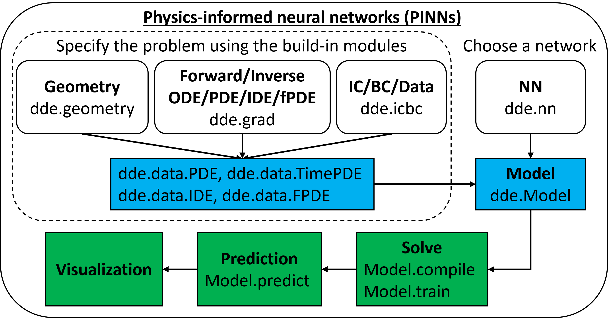
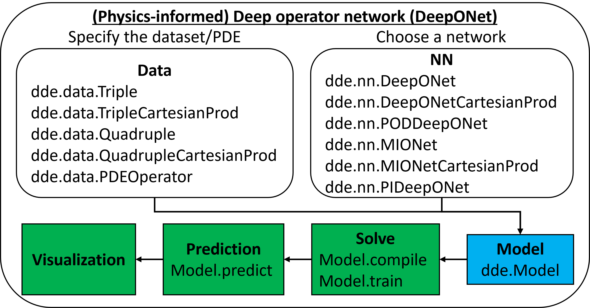
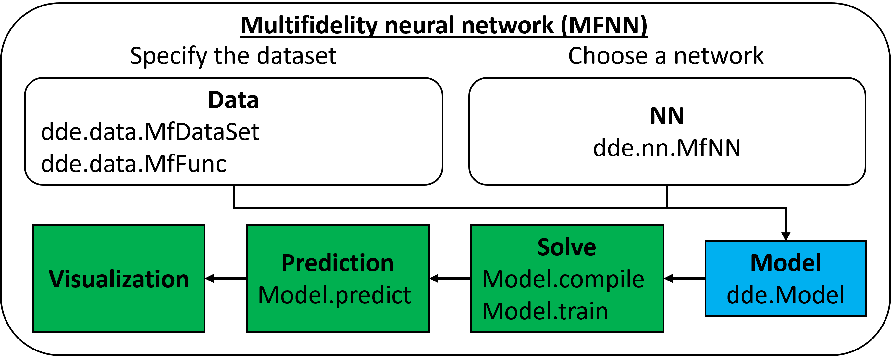
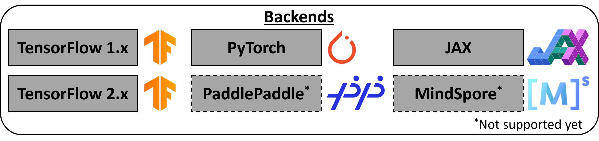

DeepXDE
=======

`DeepXDE <https://github.com/lululxvi/deepxde>`_ is a library for scientific machine learning and physics-informed learning. DeepXDE includes the following algorithms:

- physics-informed neural network (PINN)
    - solving different problems
        - solving forward/inverse ordinary/partial differential equations (ODEs/PDEs) [`SIAM Rev. <https://doi.org/10.1137/19M1274067>`_]
        - solving forward/inverse integro-differential equations (IDEs) [`SIAM Rev. <https://doi.org/10.1137/19M1274067>`_]
        - fPINN: solving forward/inverse fractional PDEs (fPDEs) [`SIAM J. Sci. Comput. <https://doi.org/10.1137/18M1229845>`_]
        - NN-arbitrary polynomial chaos (NN-aPC): solving forward/inverse stochastic PDEs (sPDEs) [`J. Comput. Phys. <https://doi.org/10.1016/j.jcp.2019.07.048>`_]
        - PINN with hard constraints (hPINN): solving inverse design/topology optimization [`SIAM J. Sci. Comput. <https://doi.org/10.1137/21M1397908>`_]
    - improving PINN accuracy
        - residual-based adaptive sampling [`SIAM Rev. <https://doi.org/10.1137/19M1274067>`_, `Comput. Methods Appl. Mech. Eng. <https://doi.org/10.1016/j.cma.2022.115671>`_]
        - gradient-enhanced PINN (gPINN) [`Comput. Methods Appl. Mech. Eng. <https://doi.org/10.1016/j.cma.2022.114823>`_]
        - PINN with multi-scale Fourier features [`Comput. Methods Appl. Mech. Eng. <https://doi.org/10.1016/j.cma.2021.113938>`_]
    - `Slides <https://github.com/lululxvi/tutorials/blob/master/20211210_pinn/pinn.pdf>`_, `Video <https://www.youtube.com/watch?v=Wfgr1pMA9fY&list=PL1e3Jic2_DwwJQ528agJYMEpA0oMaDSA9&index=13>`_, `Video in Chinese <http://tianyuan.xmu.edu.cn/cn/minicourses/637.html>`_
- (physics-informed) deep operator network (DeepONet)
    - DeepONet: learning operators [`Nat. Mach. Intell. <https://doi.org/10.1038/s42256-021-00302-5>`_]
    - DeepONet extensions, e.g., POD-DeepONet [`Comput. Methods Appl. Mech. Eng. <https://doi.org/10.1016/j.cma.2022.114778>`_]
    - MIONet: learning multiple-input operators [`SIAM J. Sci. Comput. <https://doi.org/10.1137/22M1477751>`_]
    - physics-informed DeepONet [`Sci. Adv. <https://doi.org/10.1126/sciadv.abi8605>`_]
    - multifidelity DeepONet [`Phys. Rev. Research <https://doi.org/10.1103/PhysRevResearch.4.023210>`_]
    - DeepM&Mnet: solving multiphysics and multiscale problems [`J. Comput. Phys. <https://doi.org/10.1016/j.jcp.2021.110296>`_, `J. Comput. Phys. <https://doi.org/10.1016/j.jcp.2021.110698>`_]
    - Reliable extrapolation [`arXiv <https://arxiv.org/abs/2212.06347>`_]
- multifidelity neural network (MFNN)
    - learning from multifidelity data [`J. Comput. Phys. <https://doi.org/10.1016/j.jcp.2019.109020>`_, `PNAS <https://doi.org/10.1073/pnas.1922210117>`_]

DeepXDE supports five tensor libraries as backends: TensorFlow 1.x (``tensorflow.compat.v1`` in TensorFlow 2.x), TensorFlow 2.x, PyTorch, JAX, and PaddlePaddle. For how to select one, see `Working with different backends <https://deepxde.readthedocs.io/en/latest/user/installation.html#working-with-different-backends>`_.

**Documentation**: `ReadTheDocs <https://deepxde.readthedocs.io/>`_

Features
--------

DeepXDE has implemented many algorithms as shown above and supports many features:

- enables the user code to be compact, resembling closely the mathematical formulation.
- **complex domain geometries** without tyranny mesh generation. The primitive geometries are interval, triangle, rectangle, polygon, disk, cuboid, sphere, hypercube, and hypersphere. Other geometries can be constructed as constructive solid geometry (CSG) using three boolean operations: union, difference, and intersection. DeepXDE also supports a geometry represented by a point cloud.
- 5 types of **boundary conditions** (BCs): Dirichlet, Neumann, Robin, periodic, and a general BC, which can be defined on an arbitrary domain or on a point set.
- different **neural networks**: fully connected neural network (FNN), stacked FNN, residual neural network, (spatio-temporal) multi-scale Fourier feature networks, etc.
- many **sampling methods**: uniform, pseudorandom, Latin hypercube sampling, Halton sequence, Hammersley sequence, and Sobol sequence. The training points can keep the same during training or be resampled (adaptively) every certain iterations.
- 4 **function spaces**: power series, Chebyshev polynomial, Gaussian random field (1D/2D).
- different **optimizers**: Adam, L-BFGS, etc.
- conveniently **save** the model during training, and **load** a trained model.
- **callbacks** to monitor the internal states and statistics of the model during training: early stopping, etc.
- **uncertainty quantification** using dropout.
- **float32** and **float64**.
- many other useful features: different (weighted) losses, learning rate schedules, metrics, etc.

All the components of DeepXDE are loosely coupled, and thus DeepXDE is well-structured and highly configurable. It is easy to customize DeepXDE to meet new demands.

User guide
----------

.. toctree::
  :maxdepth: 2

  user/installation

.. toctree::
  :maxdepth: 1

  demos/function
  demos/pinn_forward
  demos/pinn_inverse
  demos/operator
  user/faq

.. toctree::
  :maxdepth: 2

  user/research
  user/cite_deepxde
  user/team

API reference
-------------

If you are looking for information on a specific function, class or method, this part of the documentation is for you.

.. toctree::
  :maxdepth: 2
  :caption: API

  modules/deepxde
  modules/deepxde.data
  modules/deepxde.geometry
  modules/deepxde.icbc
  modules/deepxde.nn
  modules/deepxde.nn.jax
  modules/deepxde.nn.paddle
  modules/deepxde.nn.pytorch
  modules/deepxde.nn.tensorflow
  modules/deepxde.nn.tensorflow_compat_v1
  modules/deepxde.optimizers
  modules/deepxde.utils

Indices and tables
==================

* :ref:`genindex`
* :ref:`modindex`
* :ref:`search`
