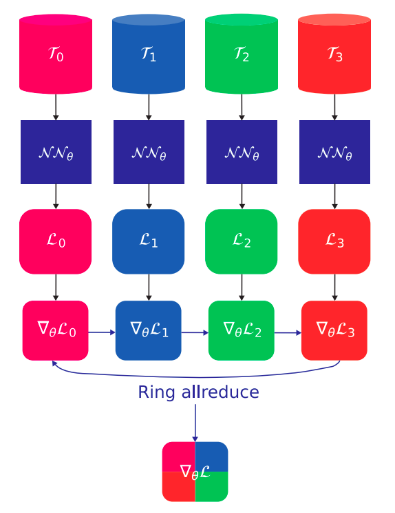
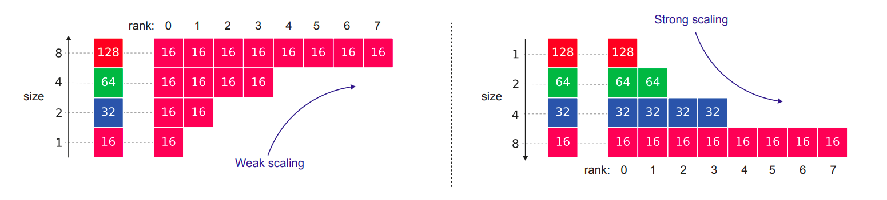

Parallel Training
=================

Introduction
------------

DeepXDE utilizes data-parallel acceleration through the `Horovod <https://horovod.readthedocs.io/>`_ training framework. To compensate for the memory shortcomings of GPUs, batch size can be increased through data-parallel acceleration:

For :math:`\textrm{size}` GPUs and :math:`\textrm{rank}=1, \cdots, \mathrm{size}`, the data-parallel approach is as follows.

- We define a dataset :math:`\mathcal{T}_\textrm{rank}` for each rank;

- We send the same synchronized copy of the neural network :math:`\mathcal{N}\mathcal{N}_\theta` to each rank. Each rank evaluates its local loss :math:`\mathcal{L}_\textrm{rank}` and gradient :math:`\nabla_\theta \mathcal{L}_\textrm{rank}`;

- The gradients are then averaged using an all-reduce operation, such as the ring all-reduce implemented in Horovod, which is known to be optimal with respect to the number of ranks.

The process is illustrated below for :math:`\textrm{size} = 4`. The ring-allreduce algorithm involves each of the size nodes communicating with two of its peers :math:`2×(\textrm{size}−1)` times.

   Data-parallel framework. Horovod supports ring-allreduce algorithm.

Weak and strong scaling
-----------------------

Two key concepts in data distribution paradigms are weak and strong scaling, which can be explained as follows: Weak scaling involves increasing the problem size proportionally with the number of processors, while strong scaling involves keeping the problem size fixed and increasing the number of processors.

For the sake of understanding, we portray below weak and strong scaling for 16 training points and :math:`\textrm{size}=8`.

   Weak and strong scaling.

Parallel training with DeepXDE
------------------------------

Data-parallel acceleration is straightforward with DeepXDE. Currently, it is supported with TensorFlow 1.x and random collocation points sampling. Acknowledge that Horovod supports PyTorch, TensorFlow 2.x, paving the way towards multiple backend acceleration.

To perform the data-parallel acceleration for 2 GPUs, simply run::

    $ horovodrun -np 2 -H localhost:2 python script.py

DeepXDE comes with weak scaling per default. To switch to strong scaling, add::

	$ import deepxde as dde 
	$ dde.config.set_parallel_scaling('strong'):

to your script preamble.

More information
----------------

To obtain more information concerning data-parallel PINNs, we refer the readers to::

  @article{escapil2023h,
    title={h-analysis and data-parallel physics-informed neural networks},
    author={Escapil-Inchausp{\'e}, Paul and Ruz, Gonzalo A},
    journal={arXiv preprint arXiv:2302.08835},
    year={2023}
  }
